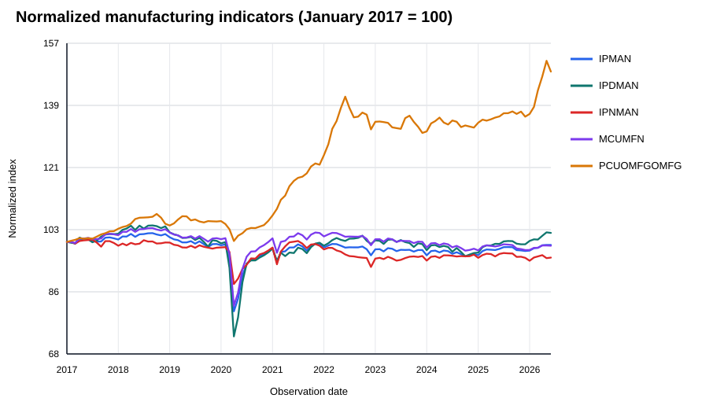

## Question

**Which supported manufacturing indicator moved farthest from its January 2017 baseline by the latest available observation?**

## Data and method

This report uses preserved monthly observations from the Federal Reserve Economic Data (FRED) series-observations API. The committed SQLite database is `data/manufacturing_monitor.db`. The selected series are `IPMAN`, `IPDMAN`, `IPNMAN`, `MCUMFN`, and `PCUOMFGOMFG`.

The analysis starts on **2017-01-01** and continues through the latest observation available in the preserved data. Original units differ across indicators, so the comparison uses the project's existing normalization method: the first valid observation for each series is set to 100. The evidence below is generated by `reports/render_report.py`, which calls `manufacturing_monitor.analytics.process_multiple_series` rather than recreating loading, validation, or analysis logic.



## Figure

{fig-alt="Line chart comparing five FRED manufacturing indicators normalized to 100 in January 2017." width=100%}

## Interpretation

The figure shows relative movement rather than direct original-unit comparison. A line above 100 indicates growth relative to the first valid observation in the selected period, while a line below 100 indicates decline. The largest distance from 100 identifies the indicator that changed most relative to its own baseline; it does not imply that its original-unit value is directly comparable with the other series.

## Reproducibility

Restore the locked project environment and rebuild the report from the repository root with:

```bash
uv sync --dev
uv run python reports/render_report.py
quarto render reports/manufacturing_report.qmd --to typst
```

The report does not contact FRED and does not require an API key. It uses committed data and reusable project code. The rendered PDF is `reports/manufacturing_report.pdf`.
